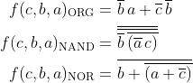
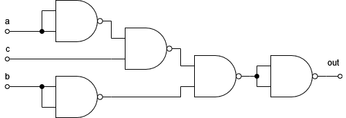
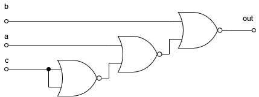
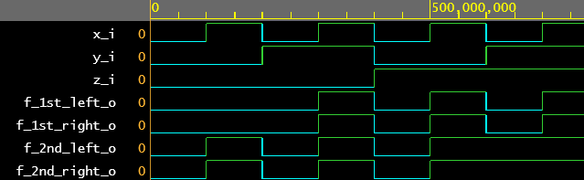

# Lab 1: ADAM ONDREJKA

### De Morgan's laws

1. Equations of all three versions of logic function f(c,b,a):

   
   
   f(c,b,a) built using only NAND gates:
   
   
   
   f(c,b,a) built using only NOR gates:
   
   
   
2. Listing of VHDL architecture from design file (`design.vhd`) for all three functions:

```vhdl
architecture dataflow of gates is
   signal s_neg : std_logic; -- Creating an intermediate signal
begin
    -- Original function(O.f.)
    f_org_o  <= (not(b_i) and a_i) or (not(c_i) and not(b_i)); 
    
    -- Producing O.f. using only nand
    s_neg <= (b_i nand b_i) nand ((a_i nand a_i) nand c_i); -- Producing an intermediate value 
    f_nand_o <= s_neg nand s_neg; -- Final negation to produce the output
    
    -- Producing O.f. using only nor
    f_nor_o  <= b_i nor (a_i nor (c_i nor c_i));  
end architecture dataflow;
```

3. Complete table with logic functions' values:

| **c** | **b** |**a** | **f(c,b,a)_ORG** | **f(c,b,a)_NAND** | **f(c,b,a)_NOR** |
| :-: | :-: | :-: | :-: | :-: | :-: |
| 0 | 0 | 0 | 1 | 1 | 1 |
| 0 | 0 | 1 | 1 | 1 | 1 |
| 0 | 1 | 0 | 0 | 0 | 0 |
| 0 | 1 | 1 | 0 | 0 | 0 |
| 1 | 0 | 0 | 0 | 0 | 0 |
| 1 | 0 | 1 | 1 | 1 | 1 |
| 1 | 1 | 0 | 0 | 0 | 0 |
| 1 | 1 | 1 | 0 | 0 | 0 |

### Distributive laws
1. First distributive law:

   
   
   Second distributive law:
   
   
   
   Screenshot with simulated time waveforms:

   
   
   It is clearly visible that both sides of each distributive law have equal response and are therefore equivalent. 

2. Link to the public EDA Playground example:

   [https://www.edaplayground.com/x/Szmn](https://www.edaplayground.com/x/Szmn)
