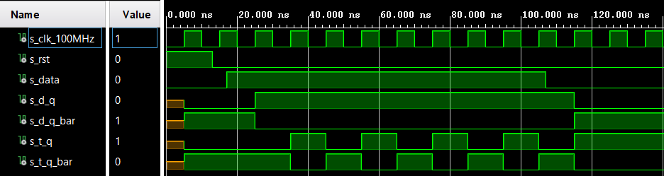

# Lab 5: ADAM ONDREJKA

### Flip-flops

1. Listing of VHDL architecture for T-type flip-flop. Always use syntax highlighting, meaningful comments, and follow VHDL guidelines:

```vhdl
architecture Behavioral of t_ff_rst is
    signal q_n       : std_logic;
begin
  
    p_t_ff_rst : process(clk)
    begin
        if rising_edge(clk) then
            if (rst = '1') then
                q_n <= '0';
                q   <= '0';
                q_bar <= '1';
            else
                q_bar <= not q_n;
                q  <= q_n;
                q_n <= (t and not(q_n)) or (not(t) and q_n);
                
            end if;
        end if;
    end process p_t_ff_rst;
    
end architecture Behavioral;
```

2. Screenshot with simulated time waveforms.

   

### Shift register

1. Image of the shift register `top` level schematic. The image can be drawn on a computer or by hand. Always name all inputs, outputs, components and internal signals!

   
