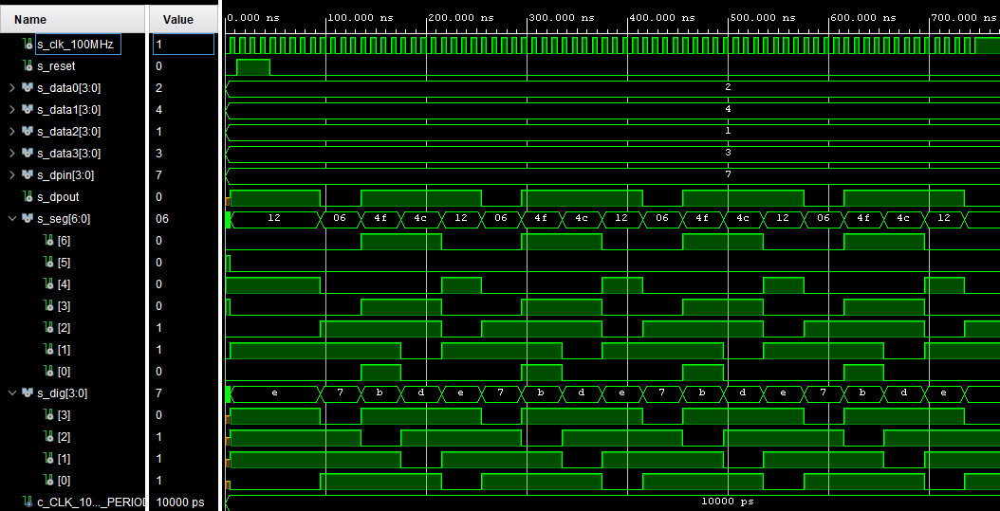
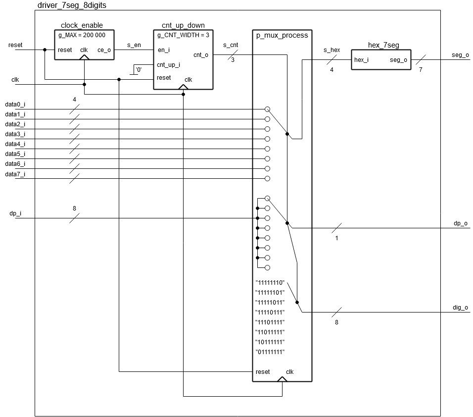

# Lab 7: ADAM ONDREJKA

### Display driver

1. Listing of VHDL code of the completed process `p_mux`:

```vhdl
    --------------------------------------------------------
    -- p_mux:
    -- A sequential process that implements a multiplexer for
    -- selecting data for a single digit, a decimal point 
    -- signal, and switches the common anodes of each display.
    --------------------------------------------------------
    p_mux : process(clk)
    begin
        if rising_edge(clk) then
            if (reset = '1') then
                s_hex <= data0_i;
                dp_o  <= dp_i(0);
                dig_o <= "1110";
            else
                case s_cnt is
                    when "11" =>
                        s_hex <= data3_i;
                        dp_o  <= dp_i(3);
                        dig_o <= "0111";

                    when "10" =>
                        s_hex <= data2_i;
                        dp_o  <= dp_i(2);
                        dig_o <= "1011";

                    when "01" =>
                        s_hex <= data1_i;
                        dp_o  <= dp_i(1);
                        dig_o <= "1101";

                    when others =>
                        s_hex <= data0_i;
                        dp_o  <= dp_i(0);
                        dig_o <= "1110";
                end case;
            end if;
        end if;
    end process p_mux;
```

2. Screenshot with simulated time waveforms:

   

### Eight-digit driver

1. Image of the 8-digit driver's block schematic. The image can be drawn on a computer or by hand. Always name all inputs, outputs, components, and internal signals!

   