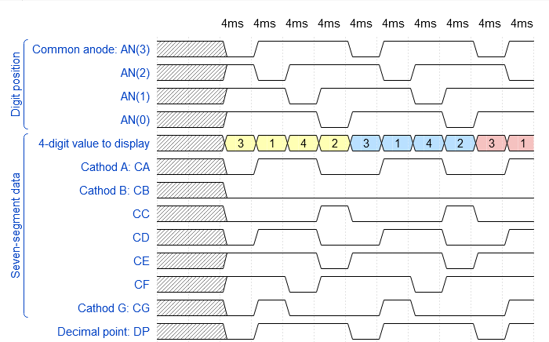

## Preparation tasks (done before the lab at home)

Due to the physiological properties of human vision, it is necessary that the time required to display the whole value is a maximum of 16&nbsp;ms. If we display four digits, then the duration of one of them is 4&nbsp;ms. If we display eight digits, the time is reduced to 2&nbsp;ms, etc.

1. See [schematic](https://github.com/tomas-fryza/Digital-electronics-1/blob/master/docs/nexys-a7-sch.pdf) or [reference manual](https://reference.digilentinc.com/reference/programmable-logic/nexys-a7/reference-manual) of the Nexys A7 board, find out the connection of 7-segment displays, and complete the signal timing to display four-digit value `3.142`.

  

  